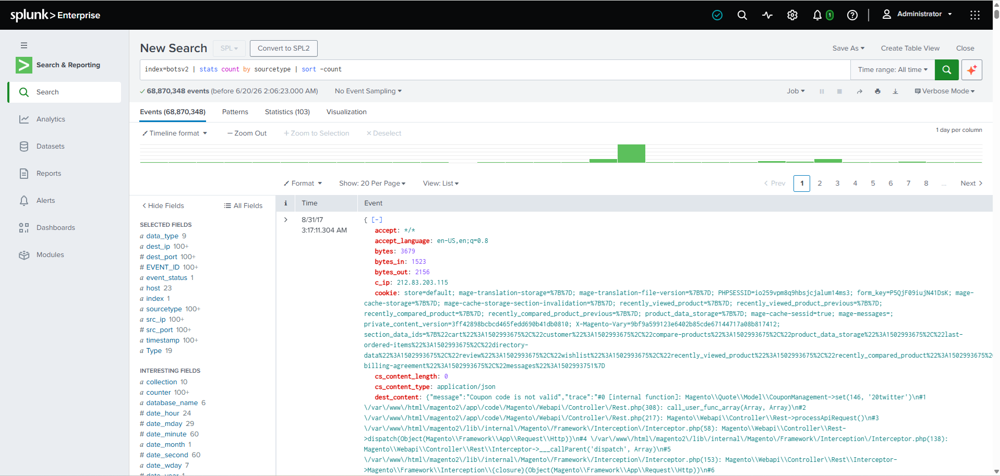
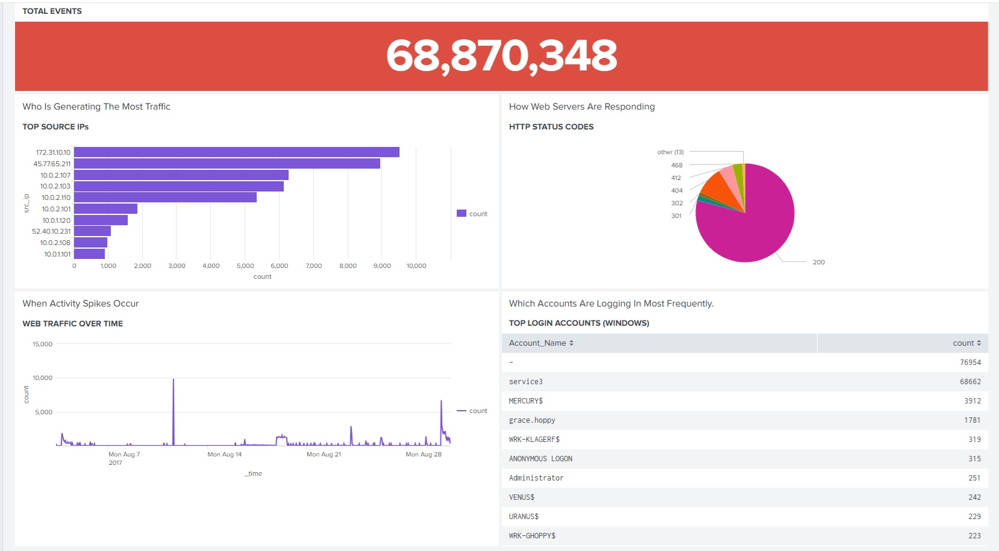

<!-- Replace bracketed placeholders with your real details before publishing. -->

# CASE-001 · SIEM Threat Detection & Dashboard Build

`Status: Documented` · `Category: Detection & Monitoring` · `Tools: Splunk Enterprise, BOTSv2 Dataset, SPL`

## Overview

This case covers standing up a working SIEM environment and learning to turn raw security logs into actionable monitoring. The lab uses **BOTSv2 (Boss of the SOC v2)** — a publicly available dataset built by Splunk for SOC training, containing logs from a simulated breach against a fictional brewing company ("Frothly"). It includes a mix of Windows event logs, network/wire data, and endpoint telemetry, which makes it realistic enough to practice real detection workflows on.

## Lab Environment

| Component | Detail |
|---|---|
| SIEM Platform | Splunk Enterprise [version] |
| Dataset | BOTSv2 |
| Indexes Used | `[index names, e.g., botsv2]` |
| Key Sourcetypes | `[e.g., WinEventLog:Security, stream:http, suricata]` |
| Deployment | [Single instance on local VM / Docker / etc.] |

## Methodology

1. **Ingest & orient** — loaded the BOTSv2 dataset into Splunk and ran broad searches (`index=botsv2`) to understand what sourcetypes and fields were available before writing any targeted queries.
2. **Hunt with SPL** — wrote searches to surface indicators of compromise across the simulated environment.
3. **Build dashboards** — translated the most useful searches into permanent dashboard panels: time charts for activity volume, tables for top talkers/users, and single-value panels for at-a-glance health checks.
4. **Rehearse the demo** — practiced presenting the dashboard live, narrating what each panel shows and why it matters to someone without a security background.

## Key SPL Queries

> Actual query

```spl
index=botsv2 | stats count by sourcetype | sort -count
```

## Dashboard


Dashboard overview: top source IPs, HTTP status code distribution, traffic volume over time, and top Windows login accounts — used to spot anomalies (unusual spikes, dominant accounts, unexpected status codes) at a glance.

## Skills Demonstrated

- SPL query writing (search, stats, timechart, eval)
- Log correlation across multiple sourcetypes
- Dashboard and visualization design
- Translating technical findings for a non-technical audience

## Reflection

The dashboard effectively surfaces high-level volume metrics (total events, top IPs, status code distribution, login frequency) but does not perform any anomaly highlighting or risk-based prioritization. All data points — whether benign (a routine service account) or potentially significant (an external IP generating high traffic, anonymous logon attempts, elevated 4xx/5xx error rates) — are presented with equal visual weight. Adding threshold-based flagging, color-coded severity, or baseline deviation indicators would reduce analyst triage time and lower the chance that a meaningful signal is missed in a high-volume environment (68.8M+ events).

(Back To [Main](/README.md))
