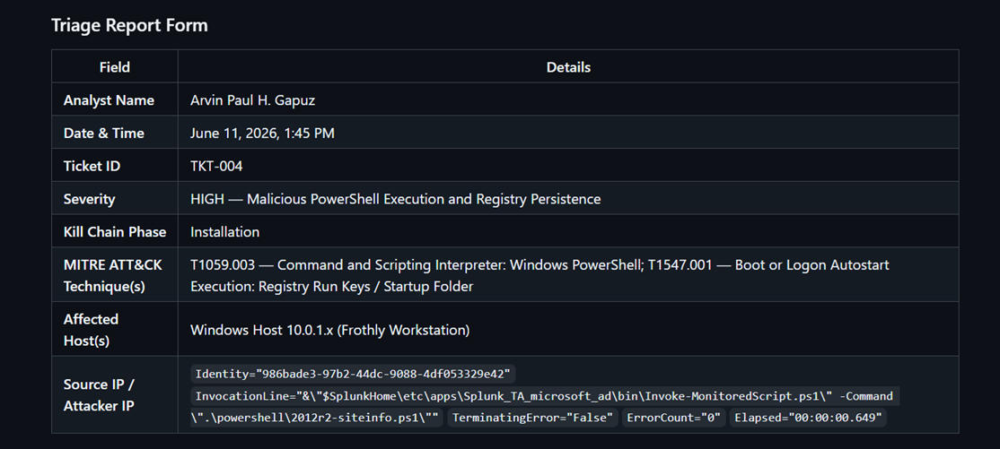
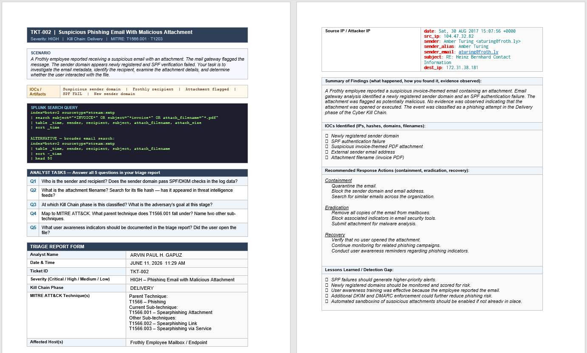

<!-- Replace bracketed placeholders with your real details before publishing. -->

# CASE-002 · Incident Triage, Ticketing & Reporting

`Status: Documented` · `Category: Incident Response` · `Tools: [Ticketing platform], Incident Report Writing`

## Overview

This case covers the part of SOC work that happens *after* detection: deciding what matters, tracking it through to resolution, and writing it up clearly enough that another analyst could pick up the case cold. Findings from the [CASE-001 Splunk dashboard work](../01-splunk-siem-monitoring/screenshots/SPLUNK_Enterprise_Dashboard_README.md) fed directly into this workflow.

## Workflow

```
Alert / Finding  →  Ticket Logged  →  Triage  →  Investigation  →  Report  →  Close
```

1. **Log it** — every alert or finding worth tracking was entered into [ticketing platform] as a ticket, rather than left as a one-off search result.
2. **Triage it** — each ticket was scored for priority before deep investigation, using the criteria below.
3. **Investigate** — pulled supporting evidence (Splunk searches, packet captures, honeypot logs) to confirm or rule out the ticket.
4. **Report it** — higher-priority tickets were written up using the [incident report template](#Incident Report).
5. **Close it** — ticket updated with final status and a link to the report.

## Triage / Priority Criteria

| Priority | Criteria | |
|---|---|---|
| **P1 – Critical** | Active compromise, confirmed data exposure | |
| **P2 – High** | Strong indicator of compromise, no confirmed impact yet | |
| **P3 – Medium** | Suspicious but plausible benign explanation | |
| **P4 – Low** | Informational / noise, logged for trend tracking | |


## Sample Tickets



## Incident Report


(See [Detailed Report](./screenshots/Triage-README.md))
## Skills Demonstrated

- Alert triage and prioritization under a defined framework
- Ticketing/case management workflow
- Incident report writing (summary, timeline, IOCs, recommendations)
- Clear, audience-aware technical communication

## Reflection

- The format shapes the honesty. Summary of Findings, then IOCs, then separately Recommended Actions, then separately Lessons Learned — forces the analyst to physically separate "what I saw" from "what I think we should do about it." A good report template is itself a control against overconfidence.
- A reader who wasn't there can't audit that — there's no underlying evidence trail showing why it's critical, just the assertion that it is. By tying severity to a specific kill chain phase and named MITRE techniques, which gives a future reader something to actually check.
- "Lessons Learned" section includes things like "SPF failures should generate higher-priority alerts" — that's not a finding about the incident, it's an admission of a detection gap. Image 1 has no equivalent field at all. Without it, the next analyst (or auditor) has no way to know the SOC already identified its own blind spot here; they'd have to rediscover it from scratch.

(Back To [Main](/README.md))
