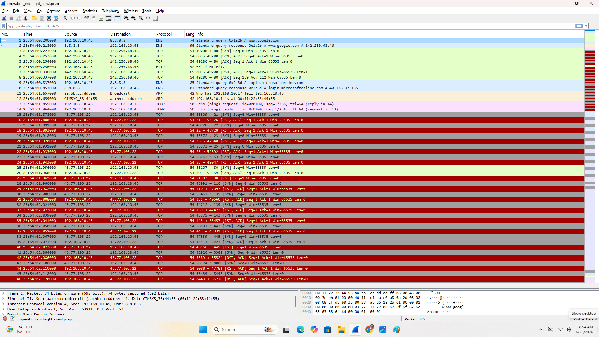
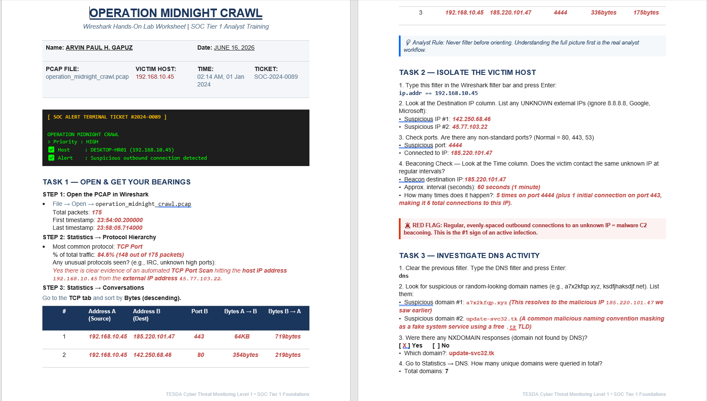
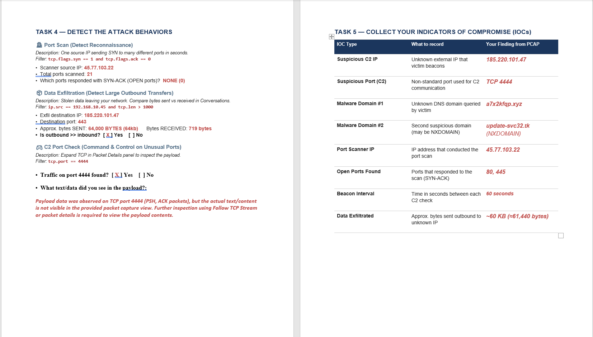

<!-- Replace bracketed placeholders with your real details before publishing. -->

# CASE-003 · Network Traffic & Packet Analysis

`Status: Documented` · `Category: Network Forensics` · `Tools: Wireshark`

## Overview

Most SOC tooling eventually points back to "go look at the packets." This case is about building that habit directly — capturing and reading raw network traffic in Wireshark instead of relying on summarized alerts.

## Lab Environment

| Component | Detail |
|---|---|
| Capture Tool | Wireshark [Version 4.6.4 (v4.6.4-0-g93282876538d).] |
| Capture Source | operation_midnight_crawl.PCAP set, honeypot segment from CASE-004 |
| Network Context | The capture spans about 4 minutes and centers on a single internal host (192.168.10.45). It contains a mix of routine background traffic — DNS lookups for common services like Windows time sync, Google, and Microsoft 365 — alongside two unusual domain lookups that don't fit that pattern. The bulk of the capture, however, is a repeating beacon: the internal host connects out to an external IP on port 4444 every 60 seconds, sends a short status check-in, and gets told to wait — five times in a row, with the final exchange ending differently from the rest. There's also a brief burst of single-packet connection attempts from a separate external IP to several common service ports on the same internal host, suggesting a short scan rather than a sustained session. |

## Methodology

1. **Orient with protocol hierarchy** — opened each capture and reviewed *Statistics → Protocol Hierarchy* before drilling into individual frames, to understand the overall traffic mix first.
2. **Filter with intent** — used display filters to isolate specific conversations and patterns rather than scrolling raw captures.
3. **Follow the stream** — reconstructed full TCP/HTTP sessions using *Follow → TCP Stream* to see what actually happened end-to-end, not just that a connection occurred.
4. **Baseline vs. anomaly** — compared a capture of "normal" traffic against a capture with suspicious activity to build a feel for what should draw attention.

## Screenshots

*This is a simulated incident called "Operation Midnight Crawl" — a training PCAP (operation_midnight_crawl.pcap) built around a fictional SOC alert: a host named DESKTOP-HR01 (192.168.10.45) triggered a high-priority alert for suspicious outbound connections.The lab teaches the standard SOC Tier 1 triage flow — orient first with stats, then isolate the host, then dig into DNS — to confirm a beaconing malware infection.*

## Skills Demonstrated

- Packet and protocol analysis
- Wireshark display filter syntax
- TCP stream reconstruction
- Traffic baselining and anomaly identification

## Reflection

What actually surprised me was the Task 1 conversations table flattening two different things into one row — port 443 and port 4444 are the same destination IP, so Wireshark's IP-pair grouping makes a single coordinated beacon→payload sequence look like two unrelated entries. If I'd only read the worksheet, I'd have walked away thinking "beaconing" and "large transfer" were separate findings. Only once I tracked it by timestamp did it become obvious they're one continuous event 1 second apart.

(Back To [`Main`](/README.md))
