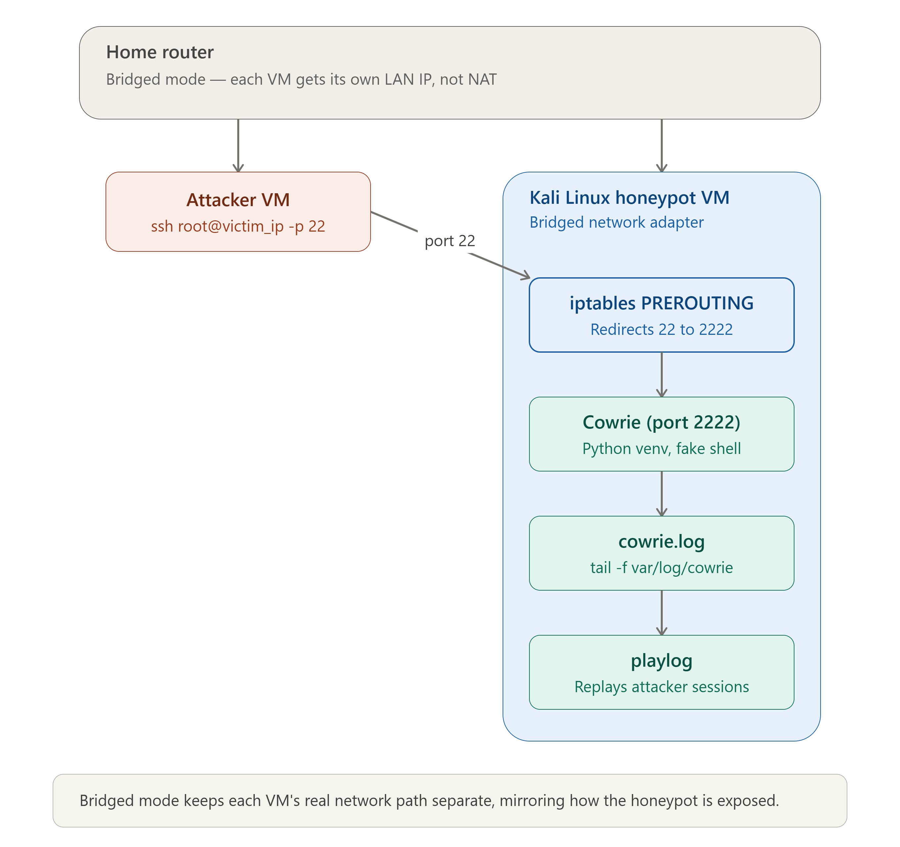

<!-- Replace bracketed placeholders with your real details before publishing. -->

# CASE-004 · Honeypot Deployment & Threat Intelligence

`Status: Documented` · `Category: Adversary Intelligence` · `Tools: Kali Linux, [Honeypot tool], Home Lab`

## Overview

A honeypot gives a firsthand, unfiltered look at what automated attackers actually do — without putting real systems at risk. This case covers deploying one inside an isolated home lab segment and analyzing what it caught.

## Lab Environment

| Component | Detail |
|---|---|
| Host OS | Kali Linux |
| Honeypot Software | Cowrie |
| Virtualization | VMware |
| Network Isolation | [e.g., host-only adapter / isolated VLAN / separate virtual switch with no route to personal devices] |
| Exposure | Exposed only within the lab network |

## Network Diagram

*The router runs in bridged mode (To switch each VM from NAT to Bridge), so the attacker VM and the Kali honeypot VM each get a real LAN-routable IP rather than sitting behind NAT. The attacker connects over standard SSH port 22, but iptables on the Kali VM silently redirects that traffic to port 2222, where Cowrie is actually listening with its fake shell — the attacker never touches a real system service. Everything they do gets written to cowrie.log in real time, and playlog lets you replay the full session afterward like a recording.*

## Methodology

1. **Isolate first** — built a dedicated network segment so the honeypot could be exposed without any path back to personal devices or data.
2. **Deploy & configure** — installed and configured [honeypot tool] on Kali Linux to passively log connection attempts, credentials tried, and any commands executed by a connecting party.
3. **Let it run** — left the honeypot live for [duration] to collect a realistic sample of automated scanning/attack traffic.
4. **Analyze the logs** — reviewed honeypot logs for patterns: common usernames/passwords attempted, source IP behavior, scanning cadence, and any follow-on actions after a simulated "successful" login.
5. **Cross-reference with packets** — correlated honeypot application-layer logs against the matching Wireshark capture (see [CASE-003](../03-wireshark-traffic-analysis)) to connect what was logged at the service level with what was visible on the wire.

## Findings

*Findings from this lab highlighted the difference between functional and secure deployment — e.g., bridged networking provided connectivity but not isolation. Future iterations would incorporate VLAN segmentation and persistent firewall rules to better reflect production honeypot practices.*

## Skills Demonstrated

- Honeypot deployment and configuration
- Network segmentation and isolation design
- Log analysis and pattern recognition
- Correlating application-layer and network-layer evidence

## Reflection

[1–3 sentences: what did seeing live attack attempts teach you that reading about threats didn't, and what would you add to the lab next — e.g., a second honeypot type, longer collection window, or basic geolocation/ASN enrichment of source IPs.]
